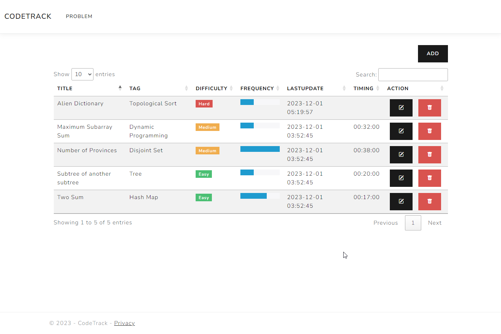

Today felt like just another lazy Sunday, where my morning started fashionably late at 11 AM. Lazing around, I got sucked into the vortex of my favorite computer game, Total War: Warhammer 3. Hours melted away like snow on a sunny day, and suddenly, a wave of unproductivity hit me.

In an attempt to shake off the sluggishness, I decided to tackle the IBM coding assessment that had been sitting in my inbox for a week. With the deadline just seven days away, the clock was ticking. I'd danced with this assessment before, passing the technical round for a different role but falling short of the ultimate goal. No reasons given, just a "Thanks, but no thanks."

This time, armed with newfound determination, I dove into the assessment. Two challenges lay ahead: an algorithm problem and an SQL puzzle. The algorithm demanded the use of a hash set, a twist that made my brain cells do a little workout. The SQL, rusty from disuse, required a bit of syntax revival, but I conquered it. Surprisingly, I finished the test in a breezy 45 minutes.

Post-assessment, a wave of confidence washed over me. It felt like I'd found a magic potion to cure my self-esteem woes. I had doubted my programming prowess, but those solved questions became my confidence boosters.

Fuelled by this newfound vigor, I delved into a couple of LeetCode problems, vowing to be disciplined and consistent in my problem-solving practice. As I celebrated this small victory, a pang of guilt hit me—I had been slacking on my pet project, "CodeTrack," for a two-day streak. Note to self: Better fix that tomorrow morning.

Looking at my current "CodeTrack" state, it wasn't winning any awards yet, but hey, Rome wasn't built in a day. Slow and steady progress was the mantra. Believe me, it'll shine!



Right now, my web app only shows a list of problems in a data table. Tomorrow's plan? Spice things up! I'm thinking of adding a clock or graph, still pondering the design. Creating the landing page for the web app sounds like a fun challenge too!

Talking about LeetCode problems, I cracked two in the evening. Both seemed familiar, making the implementation a breeze.

The first one involved a cool data structure called Disjoint Set, part of a graph problem. With "`find`" and "`union`" operations, I needed to count the number of cities in a connected graph. The provided adjacent matrix made it feel like solving a puzzle.

```python
class UnionFind():
    def __init__(self, n):
        self.root = [i for i in range(n)]
        self.rank = [1] * n
    
    def find(self, x):
        if x == self.root[x]:
            return x
        self.root[x] = self.find(self.root[x])
        return self.root[x]
    
    def union(self, x, y):
        root_x = self.find(x)
        root_y = self.find(y)
        if root_x == root_y:
            return 0
        if root_x != root_y:
            if self.rank[root_x] < self.rank[root_y]:
                self.root[root_x] = root_y
            elif self.rank[root_x] > self.rank[root_y]:
                self.root[root_y] = root_x
            else:
                self.root[root_y] = root_x
                self.rank[root_x] += 1

        return 1
        

def find_connected_cities(is_city_connected):
    n = len(is_city_connected)
    uf = UnionFind(n)
    num_of_cities = n
    for row in range(n):
        for col in range(n):
            if is_city_connected[row][col] == 1:
                num_of_cities -= uf.union(row, col)

    return num_of_cities
```

The second problem was simpler. Rotate an array of numbers around a pivot (k) in O(1) space. No fancy tricks; I just applied the reverse array trick a couple of times to get the job done.

Exciting times ahead, contemplating web app designs and conquering LeetCode challenges!

```python
class Solution:
    def rotate(self, nums: List[int], k: int) -> None:
        """
        Do not return anything, modify nums in-place instead.
        """
        def rotate_helper(l, r, nums):
            while l <= r:
                nums[l], nums[r] = nums[r], nums[l]
                l += 1
                r -= 1
        

        rotate_helper(0, len(nums) - 1, nums)
        if k > len(nums):
            k = k % len(nums)
        rotate_helper(0, k - 1, nums)
        rotate_helper(k, len(nums) - 1, nums)
        
```

And that's a wrap for today's musings! Now, let's sprinkle a bit of pizzazz for my future self.

<h2>For Future Me:</h2>
Guess what? Life's like this grand adventure game, and challenges are the power-ups to level you up! When the journey gets tricky, don't hit pause—conquer it like a boss. Picture yourself as the superhero of your story, molding character in the forge of adversity. It's like you're building a fortress of resilience! Heavy burdens? Nah, just opportunities for a workout. You're not surrendering; you're upgrading!

Remember, each struggle is like finding hidden treasures in a game—vital for your epic character development. So, stay committed, Future Me! You're not just enduring; you're acing this game, emerging with a strength buff. Those obstacles? Stepping stones to becoming the legendary you. Embrace the struggle; it's the secret potion that forges your greatness.

Game on, future legend!