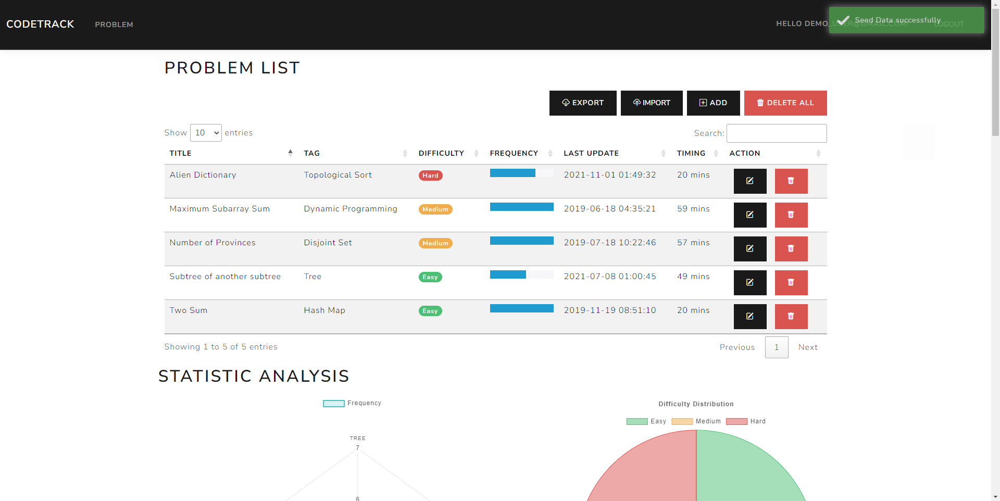

# CodeTrack Development Progress

Over the last three days, I found myself lacking motivation for both coding practice and my personal project, falling into an overthinking loop that led to some moments of feeling down. However, I took a step back, reevaluated my situation, and realized that this wasn't even rock bottom. I still had plenty of potential and energy to achieve my goals. So, I woke up with a renewed determination, telling myself that I could push through this tough situation.

A positive note came when I received an email from a government job asking for an update on my resume. I took the opportunity to inform the HR personnel that I needed a few days to finish my CodeTrack project, aiming to deploy and showcase my work. I believe this would make my candidacy more appealing than others.

Today, I delved into learning how to use ASP.NET to add a new scaffolded item called [Identity](https://learn.microsoft.com/en-us/aspnet/core/security/authentication/identity?view=aspnetcore-7.0&tabs=visual-studio). Essentially, it's a feature in ASP.NET Core that allows developers to leverage pre-built and boilerplate code for user account creation. Incorporating this Identity library alleviated concerns about authentication and authorization processes. Even handling token passing between Web APIs became much more straightforward than I initially thought. As depicted below, ASP.CORE Identity helped me generate tables and hash user passwords to enhance the security of my web application.

While there's still much to explore in utilizing this API, the documentation from Microsoft highlighted that Identity supports user interface (UI) for both login and register functionalities. Additionally, it aids in managing users, passwords, profile data, roles, claims, tokens, email confirmation, and more.

Today's progress was substantial, and I'm grateful for overcoming the hurdles. Here are screenshots depicting the progress:


For my use case, since I wanted each user to have his or her own problem lists. What I needed to do was
- Create the application class that was inherited from IdentityUser class from ASP.NET Core Identity
```csharp
using Microsoft.AspNetCore.Identity;
using System.ComponentModel.DataAnnotations;

namespace CodePracticeTrackingApp.Models
{
    public class ApplicationUser : IdentityUser
    {
        [Required]
        public string Name { get; set; }
        public string Email { get; set; }
        public int Age { get; set; }
        public string StreetAddress { get; set; }
        public string City { get; set; }
        public string State { get; set; }
        public string PostalCode { get; set; }
    }
}

```
- In my own model, I needed to add the navigation properties to link the two tables together. The important thing is the ForeignKey that should be specified properly.
```csharp
using Microsoft.AspNetCore.Mvc.ModelBinding.Validation;
using Microsoft.AspNetCore.Mvc.Rendering;
using System.ComponentModel;
using System.ComponentModel.DataAnnotations;
using System.ComponentModel.DataAnnotations.Schema;
using System.Configuration;

namespace CodePracticeTrackingApp.Models
{
    public class Problem
    {
        [Key]
        public int Id { get; set; }
        [Required(ErrorMessage = "This field is required")]
        [RegularExpression("^[a-zA-Z ]*$", ErrorMessage = "Only alphabet is allowed")]
        public string Title { get; set; }
        [RegularExpression("^[a-zA-Z ]*$", ErrorMessage = "Only alphabet is allowed")]
        public string? Tag { get; set; }
        [DefaultValue(0)]
        public int Frequency { get; set; } = 0;
        [Required(ErrorMessage = "This field is required")]
        public string Difficulty { get; set; }
        [DataType(DataType.Date)]
        [DisplayName("Last Update")]
        public DateTime LastUpdate { get; set; }
        [DisplayName("Time (minutes)")]
        public double Timing { get; set; }

        // Navigation property for the user
        public string ApplicationUserId { get; set; }
        [ForeignKey("ApplicationUserId")]
        [ValidateNever]
        public ApplicationUser ApplicationUser { get; set; }
    }
}

```
- In my program.cs, I added the following code to wire up the [dependency injection](https://learn.microsoft.com/en-us/aspnet/core/fundamentals/dependency-injection?view=aspnetcore-7.0)

```csharp
using CodePracticeTrackingApp.Data;
using CodePracticeTrackingApp.Models;
using Microsoft.EntityFrameworkCore;
using Microsoft.AspNetCore.Identity;
using CodePracticeTrackingApp.Utilities;
using Microsoft.AspNetCore.Identity.UI.Services;

var builder = WebApplication.CreateBuilder(args);

// dependecy injection
// tell .net to use EF and connect to SQL server 
builder.Services.AddDbContext<DatabaseContext>(options => options.UseSqlServer(builder.Configuration.GetConnectionString("DefaultConnection")));

//builder.Services.AddDefaultIdentity<IdentityUser>(options => options.SignIn.RequireConfirmedAccount = true).AddEntityFrameworkStores<DatabaseContext>();
//builder.Services.AddDefaultIdentity<IdentityUser>().AddEntityFrameworkStores<DatabaseContext>();
// add asp role to database
builder.Services.AddIdentity<IdentityUser, IdentityRole>().AddEntityFrameworkStores<DatabaseContext>().AddDefaultTokenProviders();

// use the following for unauthorize pages
builder.Services.ConfigureApplicationCookie(options =>
{
    options.LoginPath = $"/Identity/Account/Login";
    options.LogoutPath = $"/Identity/Account/Logout";
    options.AccessDeniedPath = $"/Identity/Account/AccessDenied";
});

// tell .net that we are using razorpage
builder.Services.AddRazorPages();

// register email sender to send email when user registers
builder.Services.AddScoped<IEmailSender, EmailSender>();

// Add services to the container.
builder.Services.AddControllersWithViews();

var app = builder.Build();

using (var scope = app.Services.CreateScope())
{
    var services = scope.ServiceProvider;

    //SeedData.Initialize(services);
}

// Configure the HTTP request pipeline.
if (!app.Environment.IsDevelopment())
{
    app.UseExceptionHandler("/Home/Error");
    // The default HSTS value is 30 days. You may want to change this for production scenarios, see https://aka.ms/aspnetcore-hsts.
    app.UseHsts();
}


app.UseHttpsRedirection();
app.UseStaticFiles();

app.UseRouting();
app.UseAuthentication();
app.UseAuthorization();

// need the following to use razor pages inside mvc
app.MapRazorPages();

app.MapControllerRoute(
    name: "default",
    pattern: "{controller=Home}/{action=Index}/{id?}");
//pattern: "{controller=Problem}/{action=Index}/{id?}");

app.Run();

```

==Tips: To get the current login user in web application, I used following snippet code to achieve that.==
```csharp
private string GetCurrentUserId()
{
    var claimsIdentity = (ClaimsIdentity)User.Identity;
    var userId = claimsIdentity.FindFirst(ClaimTypes.NameIdentifier).Value;
    return userId;
}
```

It was a good learning experience and review for me. Note that, the code above is just for reference. It was not intended for production code. Generally, I was happy with the today's progress. Here are the screenshots for my progress.




# Workout Routine
At 6:30 PM, as usual, I headed to my friend's gym for our workout session. Tonight's focus was on heavy exercises, with two main activities:
1. We aimed for a single rep at our personal record while pushing hard on the bench lift. Personally, I realized my current strength limitations as I struggled with the 45lb bar and 15lb plate. The encouragement from my gym buddies to give my best and push with all my strength was truly appreciated.
2. Instead of pushing our hard limits with the maximum weight we could handle, we started at the maximum and gradually reduced the weights until exhaustion.

Returning home, I could feel the fatigue spreading over my body. Perhaps, this was the sensation I needed at this moment — to push myself as much as possible and never give up on my goals. Lately, I've recognized how my workout routine contributes to both my physical and mental well-being. I'm grateful to have positive gym buddies around me, creating an environment that helps me stay optimistic and positive.

# Leetcode grinding
Tonight, I revisited the Maximum Subarray problem. It was surprising that I couldn't "**flash**" the solution on the first attempt. After a few minutes of debugging my code, I successfully solved the problem within the limited time I had set for myself. For future reference and review, here is my code.
```python
def max_sub_array(nums):
    result = float('-inf')
    curr_sum = 0
    for num in nums:
        curr_sum += num
        result = max(curr_sum, result)
        if curr_sum < 0:
            curr_sum = 0
        
    return result
```

# Tomorrow's plan
- [ ] Landing/Home Page on CodeTrack
- [ ] Deployment Project
- [ ] Testing
- [ ] Leetcode problem
- [ ] Research DocFx for documentation

# For Future Me
"The only limit to our realization of tomorrow will be our doubts of today." - Franklin D. Roosevelt

This quote emphasizes that our own doubts and limiting beliefs can be the primary obstacles to future achievements. Embracing a growth mindset involves viewing challenges as opportunities for learning and understanding that effort and perseverance can lead to improvement.

Remember, the journey of personal growth is ongoing, and each challenge is a chance to learn and grow. Keep this mindset, and you'll find that your potential is limitless!