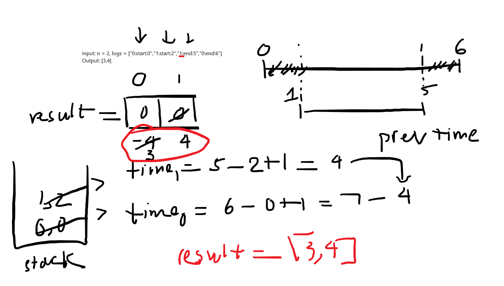

# Facing the IBM Assessment Challenge
Today marked another attempt at the IBM Frontend role coding assessment, and it didn't go as expected. The complexity of the questions caught me off guard, especially compared to my previous experiences. The first question, a medium-level algorithm challenge on LeetCode, proved particularly daunting. Despite my initial failure, I made a crucial decision—to not give up on my software engineering aspirations.

# Reflection and Resilience
The initial disappointment led to thoughts of abandoning the software engineer career path. However, a resilient spirit prevailed. Instead of succumbing to the setback, I returned to the problem with renewed determination. The 45-minute assessment became an over 2-hour learning session. Even though I couldn't crack the code on my own, I delved into the community, studying various solutions on forums like LeetCode. 

This is the [problem](https://leetcode.com/problems/exclusive-time-of-functions/) and here is my explanation for solution.

Here is my notes for solving this questions


# Problem: Exclusive Time of Functions
## My Explanation and Approach
I tackled the problem using Python, employing the `split()` function for string tokenization and a stack data structure to manage function calls. Here's a breakdown of my solution:

### Initialization:
- Utilized a stack and a return array `result`.

### Iterative Process:
- Went through the input list using a for-loop.
- Split each string into `function_id`, `tag`, and `timestamp`.

### Handling 'start' Tags:
If the tag is `start`, appended the function details to the stack.

### Calculating Exclusive Time:
- For `end` tags, calculated the time period for the current function call.
- Adjusted the exclusive time for the current and previous function calls.

## Solution Code

```python
class Solution:
    def exclusiveTime(self, n: int, logs: List[str]) -> List[int]:
        stack = []
        result = [0] * n
        for log in logs:
            func_id, tag, timestamp = log.split(':')
            timestamp = int(timestamp)
            func_id = int(func_id)
            if tag == 'start':
                stack.append([func_id, timestamp])
            else:
                curr_id, curr_timestamp = stack.pop()
                time = timestamp - curr_timestamp + 1
                result[curr_id] += time
                if stack:
                    top_id, top_timestamp = stack[-1]
                    result[top_id] -= time
        return result
```

# For Future Me
Today's setback is tomorrow's strength. Adversity shapes character. Keep pushing, stay resilient. Your breakthrough is just around the corner. Don't give up!