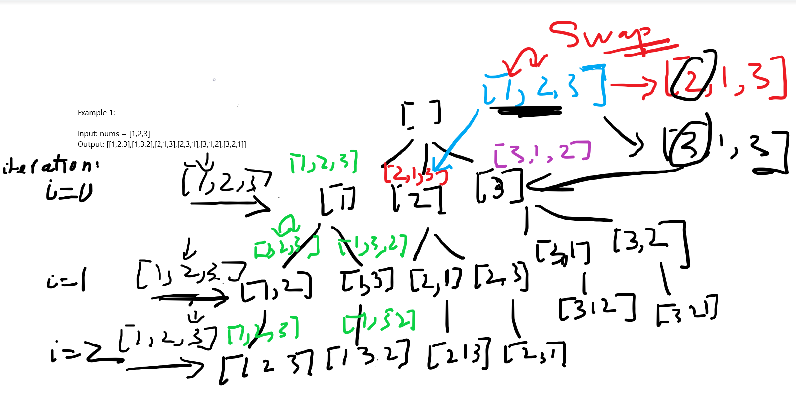

Tonight, I delved into the **Top 100 Liked List**, continuing my exploration of the Backtracking topic. The focal point of today's study is a classic problem known as [Permutations](https://leetcode.com/problems/permutations/description/?envType=study-plan-v2&envId=top-100-liked). The task at hand requires generating all possible permutations from a given array `nums`. I've successfully tackled this problem multiple times, and this time, I aimed to articulate the solution to solidify my understanding.

# Problem Statement
```

Given an array nums of distinct integers, return all the possible permutations. You can return the answer in any order.

 

Example 1:

Input: nums = [1,2,3]
Output: [[1,2,3],[1,3,2],[2,1,3],[2,3,1],[3,1,2],[3,2,1]]
Example 2:

Input: nums = [0,1]
Output: [[0,1],[1,0]]
Example 3:

Input: nums = [1]
Output: [[1]]
```

# My Explanation
In my handwritten notes, I visually depicted the algorithm before diving into the code.


I initiated the process with an empty array, gradually adding each element from the input array to my `result` array. Although my algorithm doesn't technically add elements in this manner, this figurative representation illustrates my thought process. At each iteration, a swap operation is performed to ensure the generation of all possible permutations. The backtracking algorithm is employed to explore various paths in the recursive tree. Upon completing one branch, I backtrack by re-swapping elements to their original state. This ensures that once the entire tree is traversed, all potential candidates are captured in the final result.

Here is my solution
```python
class Solution:
    def permute(self, nums: List[int]) -> List[List[int]]:
        def backtrack(index, curr, result, nums):
            if len(curr) == len(nums):
                result.append(curr[:])
                return


            for i in range(index, len(nums)):
                nums[i], nums[index] = nums[index], nums[i]
                backtrack(index + 1, curr + [nums[index]], result, nums)
                nums[i], nums[index] = nums[index], nums[i]


        result = []
        backtrack(0, [], result, nums)
        return result
```

# Solution Code
```python
# Leet code Solution
class Solution:
    def permute(self, nums: List[int]) -> List[List[int]]:
        def backtrack(curr):
            if len(curr) == len(nums):
                ans.append(curr[:])
                return
        
            for num in nums:
                if num not in curr:
                    curr.append(num)
                    backtrack(curr)
                    curr.pop()
            
        ans = []
        backtrack([])
        return ans
```