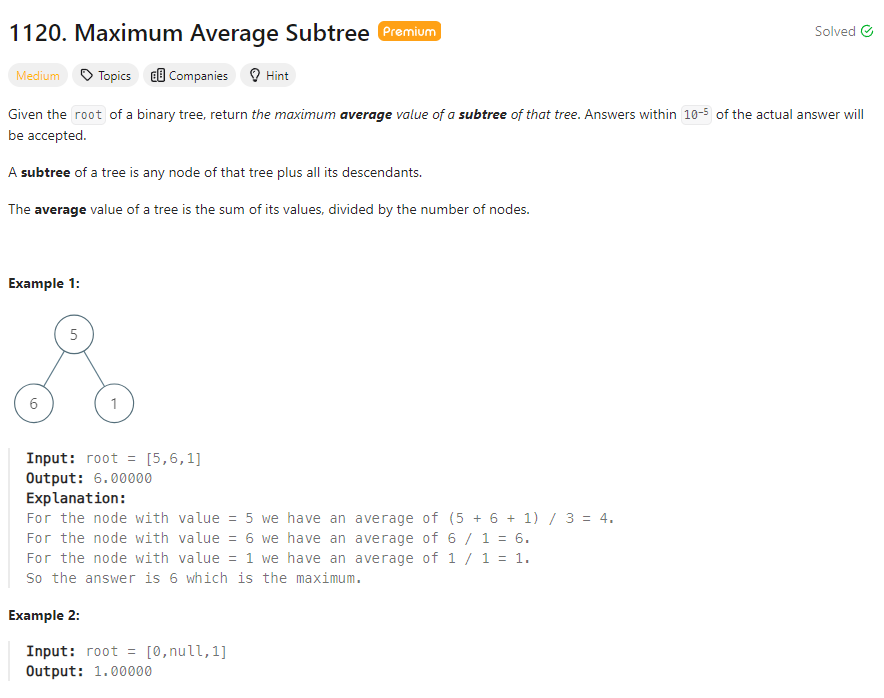

# Problem Statement


# My Explanation and Approach
The core idea of this algorithm lies in the application of Depth-First Search (DFS) to traverse a binary tree and calculate the sum and count of nodes for each subtree. DFS is a recursive algorithm that explores as far as possible along a branch before backtracking. In the context of this algorithm, the DFS traversal starts from the root of the binary tree and recursively visits each node, exploring the left and right subtrees.

The `dfs` function is the key component of the algorithm. It performs a depth-first traversal, and for each visited node, it calculates the **sum** and **count of nodes** in its left and right subtrees. These values are then used to compute the sum and count for the current subtree rooted at the current node. The algorithm maintains a running maximum of the average values encountered during the traversal.

The DFS approach ensures that every subtree is explored, and the sum and count of nodes are appropriately calculated. By updating the maximum average seen so far during the traversal, the algorithm efficiently identifies the subtree with the highest average. Overall, the core idea is to systematically explore the binary tree using DFS and maintain relevant information for each subtree to determine the maximum average subtree.

**Note:** The `dfs.result` variable is a mechanism used to maintain and update information across recursive calls in the depth-first search (DFS) traversal. In Python, unlike some other programming languages, it is not possible to directly modify variables in the outer scope from within a nested function or a function called recursively. To address this limitation, the algorithm uses a mutable attribute of the function itself.

```python
# Definition for a binary tree node.
# class TreeNode:
#     def __init__(self, val=0, left=None, right=None):
#         self.val = val
#         self.left = left
#         self.right = right
class Solution:
    def maximumAverageSubtree(self, root: Optional[TreeNode]) -> float:
        def dfs(root):
            if not root:
                return 0, 0
            L, count_left = dfs(root.left)
            R, count_right = dfs(root.right)
            count = count_left + count_right + 1
            dfs.result = max(dfs.result, (L + R + root.val) / count)
            return L + R + root.val, count

        dfs.result = 0
        dfs(root)
        return dfs.result 
```