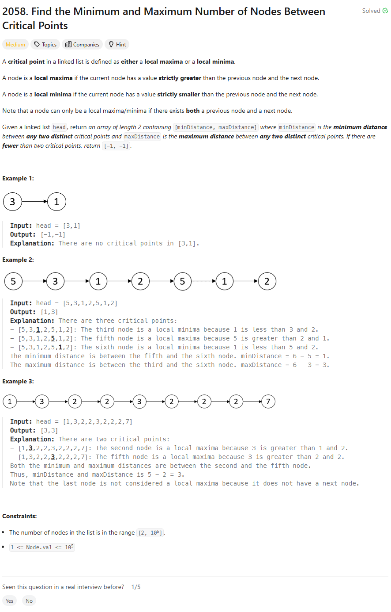

## Problem Statement



# Intuition

My first thought on solving this problem is to traverse the linked list while keeping track of the critical points. Critical points are nodes where the value is either a local maximum or a local minimum. By identifying and recording the positions of these nodes, I can then calculate the minimum and maximum distances between them.

# Approach

- Initialize an empty list `crit_pts` to store the positions of the critical points.
- Use two pointers, `prev` and `curr`, to traverse the linked list, starting from the second node.
- For each node, check if it is a critical point by comparing its value with the values of its previous and next nodes.
- If a critical point is found, append its position to the `crit_pts` list.
- After identifying all critical points, calculate the minimum and maximum distances between consecutive critical points.
- Return the minimum and maximum distances if there are at least two critical points; otherwise, return `[-1, -1]`.

# Complexity

- Time complexity:
  O(n)

- Space complexity:
  O(1) not including the space needed to store the critical points.

# Code

```python
# Definition for singly-linked list.
# class ListNode:
#     def __init__(self, val=0, next=None):
#         self.val = val
#         self.next = next
class Solution:
    def nodesBetweenCriticalPoints(self, head: Optional[ListNode]) -> List[int]:
        crit_pts = []
        prev = head
        curr = head.next
        i = 2
        while curr and curr.next:
            next_node = curr.next
            if prev.val > curr.val and curr.val < next_node.val:
                crit_pts.append(i)
            elif prev.val < curr.val and curr.val > next_node.val:
                crit_pts.append(i)
            i += 1
            prev = curr
            curr = curr.next

        min_distance = float('inf')
        max_distance = float('-inf')
        for i in range(1, len(crit_pts)):
            val = crit_pts[i] - crit_pts[i - 1]
            min_distance = min(min_distance, val)

        if len(crit_pts) >= 2:
            max_distance = crit_pts[-1] - crit_pts[0]

        return [min_distance, max_distance] if min_distance != float('inf') and max_distance != float('-inf') else [-1,-1]
```

## Editorial

One pass Approach

```python
class Solution:
    def nodesBetweenCriticalPoints(self, head: Optional[ListNode]) -> List[int]:
        result = [-1, -1]

        # Initialize minimum distance to the maximum possible value
        min_distance = float("inf")

        # Pointers to track the previous node, current node, and indices
        previous_node = head
        current_node = head.next
        current_index = 1
        previous_critical_index = 0
        first_critical_index = 0

        while current_node.next is not None:
            # Check if the current node is a local maxima or minima
            if (
                current_node.val < previous_node.val
                and current_node.val < current_node.next.val
            ) or (
                current_node.val > previous_node.val
                and current_node.val > current_node.next.val
            ):

                # If this is the first critical point found
                if previous_critical_index == 0:
                    previous_critical_index = current_index
                    first_critical_index = current_index
                else:
                    # Calculate the minimum distance between critical points
                    min_distance = min(
                        min_distance, current_index - previous_critical_index
                    )
                    previous_critical_index = current_index

            # Move to the next node and update indices
            current_index += 1
            previous_node = current_node
            current_node = current_node.next

        # If at least two critical points were found
        if min_distance != float("inf"):
            max_distance = previous_critical_index - first_critical_index
            result = [min_distance, max_distance]

        return result
```
