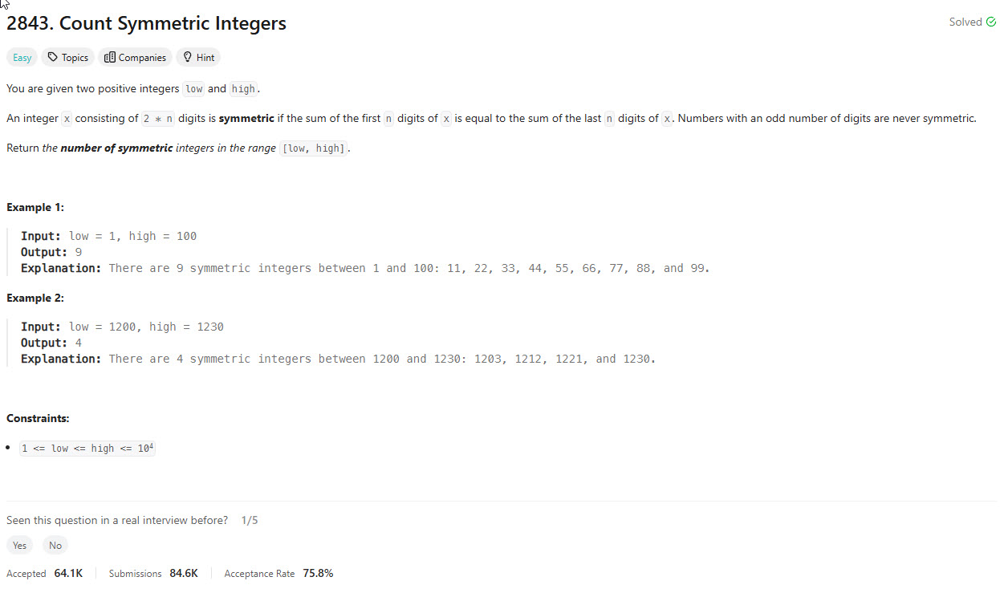

## Problem Statement



## Brute Force [Accepted]

```python

class Solution:
    def countSymmetricIntegers(self, low: int, high: int) -> int:
        res = 0
        for i in range(low, high + 1):
            if len(str(i)) % 2 == 0:
                curr = []
                num = i
                while num > 0:
                    curr.append(num % 10)
                    num = num // 10

                n = len(curr)
                mid = n // 2
                if sum(curr[:mid]) == sum(curr[mid:]):
                    res += 1
        return res
```

## Editorial

### Approach 1: Enumeration

```python
class Solution:
    def countSymmetricIntegers(self, low: int, high: int) -> int:
        res = 0
        for a in range(low, high + 1):
            if a < 100 and a % 11 == 0:
                res += 1
            if 1000 <= a < 10000:
                left = a // 1000 + a % 1000 // 100
                right = a % 100 // 10 + a % 10
                if left == right:
                    res += 1
        return res
```
